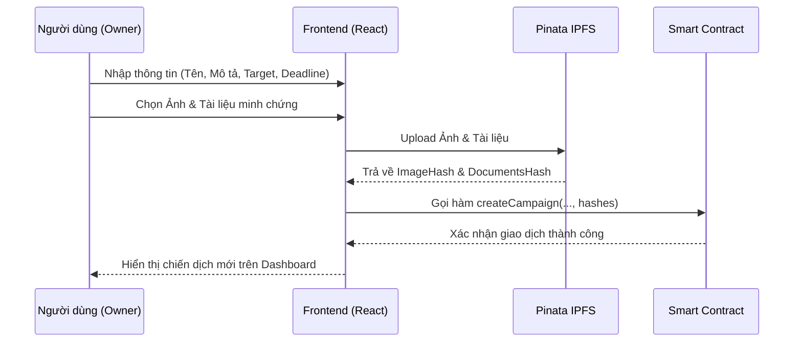
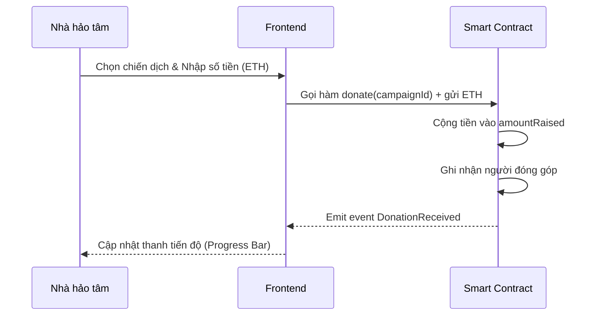
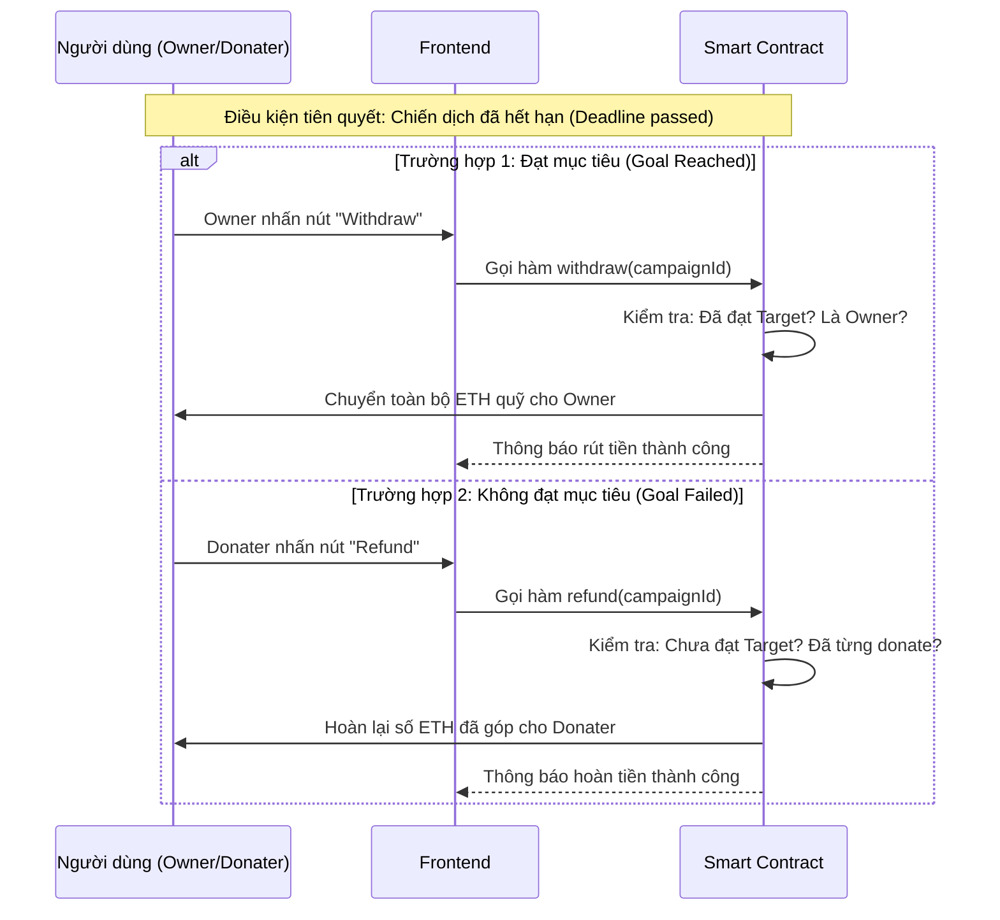

# TÀI LIỆU MÔ TẢ ĐỒ ÁN CHARITY CHAIN

## 1. Các nghiệp vụ chính (Business Processes)

Dưới đây là các quy trình cốt lõi của hệ thống.

### 1.1. Quy trình Tạo Chiến dịch (Create Campaign)
Dành cho người gây quỹ (Owner).

### 1.2. Quy trình Quyên góp (Donate)
Dành cho nhà hảo tâm (Donater).

### 1.3. Quy trình Rút tiền / Hoàn tiền (Withdraw / Refund)
Xảy ra khi chiến dịch kết thúc (hết thời gian Deadline).

---

## 2. Các ràng buộc logic (Business Rules & Constraints)

### 2.1. Ràng buộc dữ liệu đầu vào (Input Validation)
*   **Tạo chiến dịch:**
    *   Mục tiêu (Target) > 0.
    *   Thời hạn (Duration) > 0 ngày.
    *   Tên và mô tả bắt buộc nhập.
    *   File ảnh: PNG/JPG, max 5MB.
    *   File tài liệu: PDF/DOC, max 10MB.
*   **Quyên góp:**
    *   Số tiền > 0.
    *   Số dư ví > Số tiền quyên góp + Phí gas.

### 2.2. Ràng buộc nghiệp vụ (Smart Contract Logic)
*   **Rút tiền (Withdraw):** Chỉ Owner được rút khi đã hết hạn (Deadline passed) VÀ đạt mục tiêu (Goal reached).
*   **Hoàn tiền (Refund):** Donater được hoàn tiền khi đã hết hạn (Deadline passed) VÀ không đạt mục tiêu (Goal failed).
*   **Xóa chiến dịch:** Chỉ Owner được xóa khi chưa có ai quyên góp.

### 2.3. Ràng buộc bảo mật
*   **Authentication:** Đăng nhập bằng Private Key khớp với Address.

---

## 3. Các giao diện của đồ án (User Interfaces)

### 3.1. Màn hình Đăng nhập (Authentication)
*   Form đăng nhập với Wallet Address và Private Key.
*   Hiển thị danh sách Test Accounts gợi ý (từ Hardhat).

### 3.2. Màn hình Dashboard (Trang chủ)
*   **Header:** Logo, User Info (Address + Role), nút "Logout".
*   **Danh sách chiến dịch:** Hiển thị dạng lưới các thẻ chiến dịch (Campaign Cards).
*   **Nút tạo mới:** "Start Campaign" để mở modal tạo chiến dịch.

### 3.3. Chi tiết Thẻ Chiến dịch (Campaign Card)
*   **Thông tin:** Tên, Mô tả, Ảnh minh họa (IPFS), Link tài liệu (IPFS).
*   **Tiến độ:** Progress bar, Số tiền đã góp / Target, Deadline.
*   **Trạng thái:** Active (Đang chạy), Closed (Đã đóng), Goal Reached (Đạt mục tiêu).
*   **Tương tác:** Form nhập số tiền donate, các nút chức năng (Withdraw, Refund, Delete).

### 3.4. Modal Tạo Chiến dịch (Create Campaign Modal)
*   Form nhập thông tin chiến dịch.
*   **Upload Image:** Chọn ảnh cover cho chiến dịch (lưu trên IPFS).
*   **Upload Documents:** Chọn tài liệu minh chứng PDF/DOC (lưu trên IPFS).
