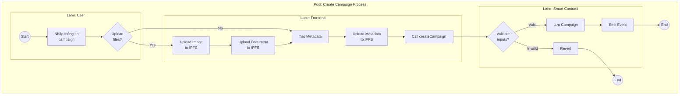
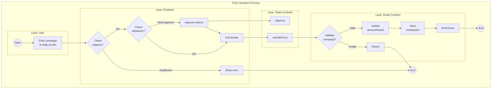
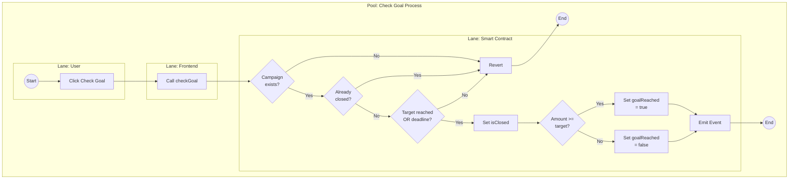
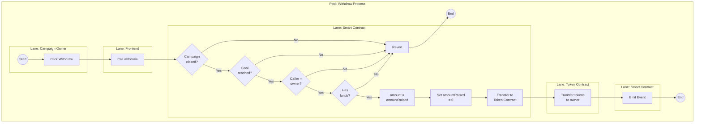
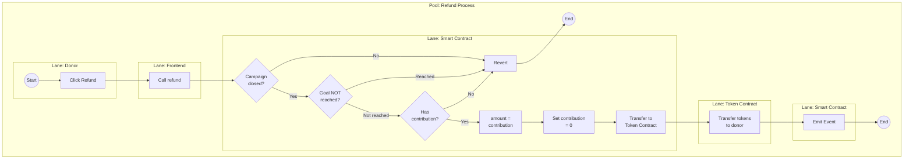
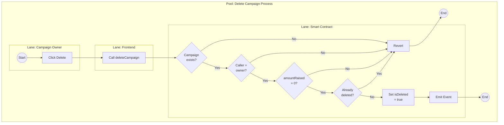

# Các Nghiệp Vụ Chính - BPMN Diagrams

## 1. Create Campaign (Tạo Chiến Dịch)

---

## 2. Donate (Quyên Góp)

---

## 3. Check Goal (Kiểm Tra Mục Tiêu)

---

## 4. Withdraw (Rút Tiền)

---

## 5. Refund (Hoàn Tiền)

---

## 6. Delete Campaign (Xóa Chiến Dịch)

---

## Chú Thích BPMN

### Ký Hiệu
- `((Start))` - Start Event (hình tròn)
- `((End))` - End Event (hình tròn đậm)
- `[Activity]` - Task (hình chữ nhật bo góc)
- `{Decision?}` - Gateway (hình thoi)
- `-->` - Sequence Flow
- `subgraph` - Pool/Lane (phân chia trách nhiệm)

### Actors (Lanes)
- **User**: Người dùng (Owner/Donor)
- **Frontend**: Giao diện ứng dụng
- **Smart Contract**: Hợp đồng thông minh
- **Token Contract**: Hợp đồng ERC-20
- **IPFS**: Hệ thống lưu trữ phi tập trung
