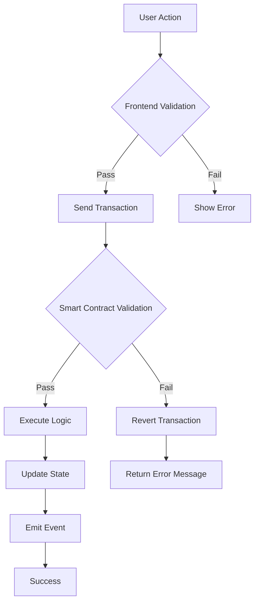

# Các Ràng Buộc Logic - Charity Chain

## Tổng Quan

Smart contract **CharityDonation.vy** có **21 ràng buộc logic** được phân loại thành 5 nhóm chính.

---

## 1. Ràng Buộc Kiểm Tra Quyền (Access Control)

### 1.1. Chỉ Owner Mới Withdraw

**File**: `CharityDonation.vy` - Line 130

```python
assert msg.sender == self.campaigns[_id].owner, "Only owner can withdraw"
```

**Mục đích**: Đảm bảo chỉ người tạo campaign mới có thể rút tiền

**Áp dụng cho**: Function `withdraw()`

---

### 1.2. Chỉ Owner Mới Delete

**File**: `CharityDonation.vy` - Line 169

```python
assert msg.sender == self.campaigns[_id].owner, "Only owner can delete"
```

**Mục đích**: Đảm bảo chỉ người tạo campaign mới có thể xóa

**Áp dụng cho**: Function `deleteCampaign()`

---

## 2. Ràng Buộc Kiểm Tra Trạng Thái (State Validation)

### 2.1. Campaign Phải Tồn Tại

**File**: `CharityDonation.vy` - Multiple locations

```python
assert _id < self.campaignCount, "Campaign does not exist"
```

**Mục đích**: Kiểm tra campaign ID hợp lệ

**Áp dụng cho**: 
- `donate()` - Line 88
- `checkGoal()` - Line 108
- `withdraw()` - Line 127
- `refund()` - Line 148
- `deleteCampaign()` - Line 169

---

### 2.2. Campaign Chưa Bị Xóa

**File**: `CharityDonation.vy` - Multiple locations

```python
assert not self.campaigns[_id].isDeleted, "Campaign is deleted"
```

**Mục đích**: Không cho phép thao tác trên campaign đã xóa

**Áp dụng cho**:
- `donate()` - Line 89
- `checkGoal()` - Line 109
- `withdraw()` - Line 128
- `refund()` - Line 149

---

### 2.3. Campaign Chưa Đóng (Donate)

**File**: `CharityDonation.vy` - Line 90

```python
assert not self.campaigns[_id].isClosed, "Campaign is closed"
```

**Mục đích**: Không cho donate vào campaign đã đóng

**Áp dụng cho**: `donate()`

---

### 2.4. Campaign Chưa Đóng (CheckGoal)

**File**: `CharityDonation.vy` - Line 110

```python
assert not self.campaigns[_id].isClosed, "Campaign is already closed"
```

**Mục đích**: Không cho check goal nhiều lần

**Áp dụng cho**: `checkGoal()`

---

### 2.5. Campaign Đã Đóng (Withdraw)

**File**: `CharityDonation.vy` - Line 129

```python
assert self.campaigns[_id].isClosed, "Campaign is not closed"
```

**Mục đích**: Chỉ withdraw khi campaign đã đóng

**Áp dụng cho**: `withdraw()`

---

### 2.6. Campaign Đã Đóng (Refund)

**File**: `CharityDonation.vy` - Line 150

```python
assert self.campaigns[_id].isClosed, "Campaign is not closed"
```

**Mục đích**: Chỉ refund khi campaign đã đóng

**Áp dụng cho**: `refund()`

---

### 2.7. Goal Đạt Được (Withdraw)

**File**: `CharityDonation.vy` - Line 130

```python
assert self.campaigns[_id].goalReached, "Goal was not reached"
```

**Mục đích**: Chỉ withdraw khi đạt mục tiêu

**Áp dụng cho**: `withdraw()`

---

### 2.8. Goal KHÔNG Đạt (Refund)

**File**: `CharityDonation.vy` - Line 151

```python
assert not self.campaigns[_id].goalReached, "Goal was reached, cannot refund"
```

**Mục đích**: Chỉ refund khi KHÔNG đạt mục tiêu

**Áp dụng cho**: `refund()`

---

## 3. Ràng Buộc Logic Nghiệp Vụ (Business Logic)

### 3.1. Chưa Quá Deadline

**File**: `CharityDonation.vy` - Line 91

```python
assert block.timestamp < self.campaigns[_id].deadline, "Campaign deadline passed"
```

**Mục đích**: Không cho donate sau deadline

**Áp dụng cho**: `donate()`

---

### 3.2. Đạt Target HOẶC Hết Hạn

**File**: `CharityDonation.vy` - Lines 112-115

```python
is_target_reached: bool = self.campaigns[_id].amountRaised >= self.campaigns[_id].targetAmount
is_deadline_passed: bool = block.timestamp >= self.campaigns[_id].deadline

assert is_target_reached or is_deadline_passed, "Campaign is still ongoing and target not reached"
```

**Mục đích**: Chỉ check goal khi đạt điều kiện kết thúc

**Áp dụng cho**: `checkGoal()`

---

### 3.3. Có Tiền Để Withdraw

**File**: `CharityDonation.vy` - Lines 133-134

```python
amount: uint256 = self.campaigns[_id].amountRaised
assert amount > 0, "No funds to withdraw"
```

**Mục đích**: Không cho withdraw khi không có tiền

**Áp dụng cho**: `withdraw()`

---

### 3.4. Có Contribution Để Refund

**File**: `CharityDonation.vy` - Lines 153-154

```python
donated_amount: uint256 = self.contributions[_id][msg.sender]
assert donated_amount > 0, "No contribution to refund"
```

**Mục đích**: Chỉ refund cho người đã donate

**Áp dụng cho**: `refund()`

---

### 3.5. Không Có Tiền Khi Delete

**File**: `CharityDonation.vy` - Line 171

```python
assert self.campaigns[_id].amountRaised == 0, "Cannot delete campaign with funds"
```

**Mục đích**: Không cho xóa campaign còn tiền

**Áp dụng cho**: `deleteCampaign()`

---

## 4. Ràng Buộc Dữ Liệu (Data Validation)

### 4.1. Donation Amount > 0

**File**: `CharityDonation.vy` - Line 92

```python
assert _amount > 0, "Donation amount must be greater than 0"
```

**Mục đích**: Không cho donate số tiền <= 0

**Áp dụng cho**: `donate()`

---

### 4.2. Target Amount > 0 (Frontend)

**File**: `App.jsx` - Lines 364-367

```javascript
if (Number(newCampaign.target) <= 0 || Number(newCampaign.duration) <= 0) {
  toast.error("Target and Duration must be positive numbers!");
  return;
}
```

**Mục đích**: Validation trước khi gửi transaction

**Áp dụng cho**: `handleCreateCampaign()`

---

### 4.3. Campaign Chưa Bị Xóa Trước Đó

**File**: `CharityDonation.vy` - Line 172

```python
assert not self.campaigns[_id].isDeleted, "Campaign already deleted"
```

**Mục đích**: Không cho xóa campaign đã xóa

**Áp dụng cho**: `deleteCampaign()`

---

## 5. Ràng Buộc Bảo Mật (Security Constraints)

### 5.1. Token Transfer Phải Thành Công

**File**: `CharityDonation.vy` - Multiple locations

```python
success: bool = extcall self.token.transferFrom(msg.sender, self, _amount)
assert success, "Token transfer failed"
```

**Mục đích**: Đảm bảo token transfer không fail

**Áp dụng cho**:
- `donate()` - Lines 95-96
- `withdraw()` - Lines 138-139
- `refund()` - Lines 159-160

---

### 5.2. Allowance Check (Frontend)

**File**: `App.jsx` - Lines 450-457

```javascript
const allowance = await tokenContract.allowance(authenticatedAccount, CONTRACT_ADDRESS);

if (allowance < amountWei) {
  toast.loading('Please approve token transfer...', { id: toastId });
  const approveTx = await tokenContract.approve(CONTRACT_ADDRESS, amountWei);
  await approveTx.wait();
  toast.success('Approval successful!', { id: toastId });
}
```

**Mục đích**: Đảm bảo contract có quyền chuyển tokens

**Áp dụng cho**: `handleDonate()`

---

### 5.3. Prevent Reentrancy (CEI Pattern)

**File**: `CharityDonation.vy` - Example in `withdraw()`

```python
# 1. Checks
assert self.campaigns[_id].isClosed
assert self.campaigns[_id].goalReached
assert msg.sender == self.campaigns[_id].owner

# 2. Effects
amount: uint256 = self.campaigns[_id].amountRaised
assert amount > 0
self.campaigns[_id].amountRaised = 0  # Update state BEFORE transfer

# 3. Interactions
success: bool = extcall self.token.transfer(msg.sender, amount)
assert success
```

**Mục đích**: Ngăn chặn reentrancy attacks bằng CEI pattern

**Áp dụng cho**: Tất cả functions có external calls

---

## Tổng Kết Ràng Buộc

| Loại Ràng Buộc | Số Lượng | Mục Đích |
|----------------|----------|----------|
| **Access Control** | 2 | Kiểm soát quyền truy cập |
| **State Validation** | 8 | Kiểm tra trạng thái hợp lệ |
| **Business Logic** | 5 | Logic nghiệp vụ |
| **Data Validation** | 3 | Validate dữ liệu đầu vào |
| **Security** | 3 | Bảo mật và ngăn attacks |
| **TỔNG** | **21** | |

---

## Ma Trận Ràng Buộc Theo Function

| Function | Số Ràng Buộc | Ràng Buộc Chính |
|----------|--------------|-----------------|
| `createCampaign` | 2 | Target > 0, Duration > 0 |
| `donate` | 6 | Exists, Not deleted, Not closed, Before deadline, Amount > 0, Transfer success |
| `checkGoal` | 4 | Exists, Not deleted, Not closed, Reached OR Expired |
| `withdraw` | 6 | Exists, Not deleted, Closed, Goal reached, Is owner, Has funds |
| `refund` | 5 | Exists, Not deleted, Closed, Goal NOT reached, Has contribution |
| `deleteCampaign` | 4 | Exists, Is owner, No funds, Not deleted |

---

## Validation Flow



### Two-Layer Validation
1. **Frontend**: UX validation, ngăn giao dịch không hợp lệ
2. **Smart Contract**: Security validation, đảm bảo tính toàn vẹn

---

## Best Practices Được Áp Dụng

✅ **Checks-Effects-Interactions (CEI) Pattern**
- Kiểm tra điều kiện trước
- Cập nhật state
- Gọi external contracts sau cùng

✅ **Fail-Fast Principle**
- Assert ngay khi phát hiện lỗi
- Không thực hiện logic không cần thiết

✅ **Clear Error Messages**
- Mỗi assert có message rõ ràng
- Dễ debug và hiểu lỗi

✅ **Defense in Depth**
- Validation ở cả frontend và contract
- Multiple layers of security

✅ **Access Control**
- Kiểm tra quyền owner
- Prevent unauthorized access
